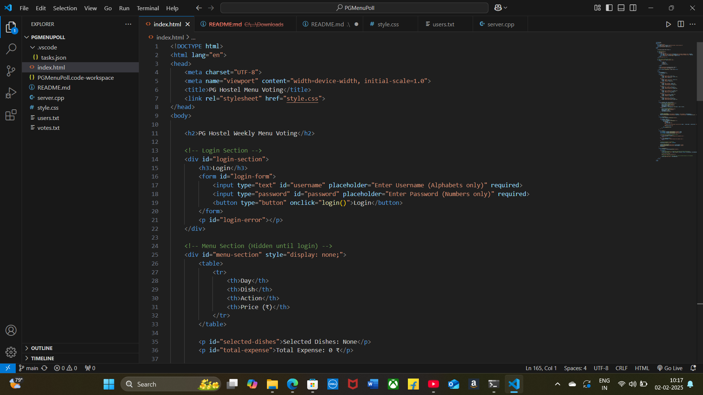

# [Project Name] 🎯
BiteCount

## Basic Details
### Team Name: [Name]
Zenith

### Team Members
- Member 1: Grashma J. - Rajagiri School of Engneering & Technology
- Member 2: Elin Maria Sabu - Rajagiri School of Engneering & Technology

### Hosted Project Link
[mention your project hosted project link here]

### Project Description
The Hostel Mess Food Count System is a web-based platform that allows students to book or cancel meals in advance, helping mess admins optimize food preparation and reduce waste. It features real-time meal tracking, automated reports, and notifications, ensuring efficient and cost-effective hostel mess management.

### The Problem statement
Hostel messes often face challenges in managing food consumption, leading to excessive food wastage, inaccurate meal planning, and inefficiencies in inventory management. Without a proper system, mess staff struggle to estimate the exact number of meals required, while students lack a convenient way to book or cancel their meals in advance. This results in operational inefficiencies, increased costs, and resource mismanagement. There is a need for an automated, real-time food count system that enables students to register their meals and helps mess administrators optimize food preparation, reduce waste, and improve overall efficiency.

### The Solution

## Technical Details
### Technologies/Components Used
For Software:
- Frontend
   HTML 
   CSS
   Javascript
- Backend
   C++
- Frameworks
   A simple final based local server in C++
- Libraries used
   Standard C++ Library
- Tools used
   VS Code
   MinGW(G++)
   Chrome Browser
   Command Prompt

For Hardware:
- PC

### Implementation
For Software:
 C:\MinGW\bin
 g++ --version
 code --install-extension ms-vscode.cpptools
 code --install-extension ritwickdey.LiveServer
 cd "C:\Users\grash\OneDrive\Documents\Desktop\PGMenuPoll"
 g++ server.cpp -o server.exe
 server.exe
# Installation
  C:\MinGW\bin
 g++ --version
 code --install-extension ms-vscode.cpptools
 code --install-extension ritwickdey.LiveServer
 cd "C:\Users\grash\OneDrive\Documents\Desktop\PGMenuPoll"

# Run
 C:\MinGW\bin
 g++ --version
 code --install-extension ms-vscode.cpptools
 code --install-extension ritwickdey.LiveServer
 cd "C:\Users\grash\OneDrive\Documents\Desktop\PGMenuPoll"

### Project Documentation
For Software:

# Screenshots (Add at least 3)

# Build Photos

*List out all components shown*

*Explain the build steps*

*Explain the final build*

### Project Demo
# Video
[Add your demo video link here]
*Explain what the video demonstrates*

# Additional Demos
[Add any extra demo materials/links]

## Team Contributions
- Grashma J: Frontend and backend
- Elin Maria Sabu: Frontend and backend

---
Made with ❤️ at TinkerHub
